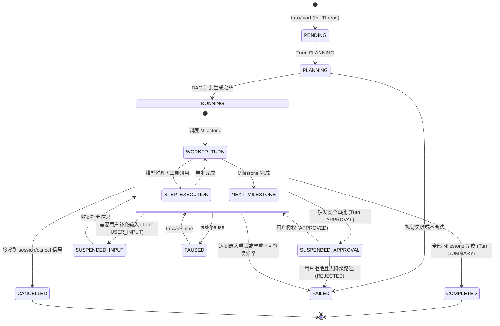
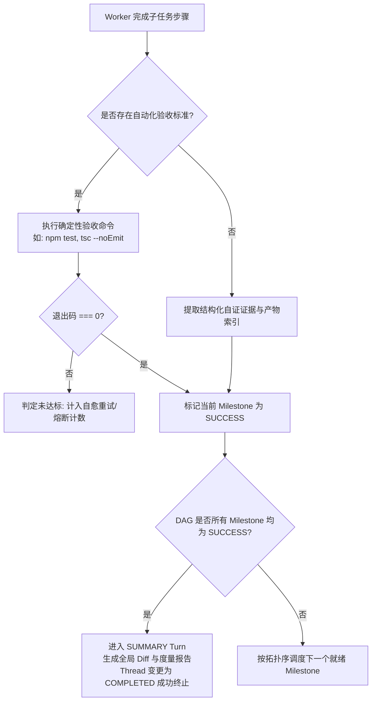
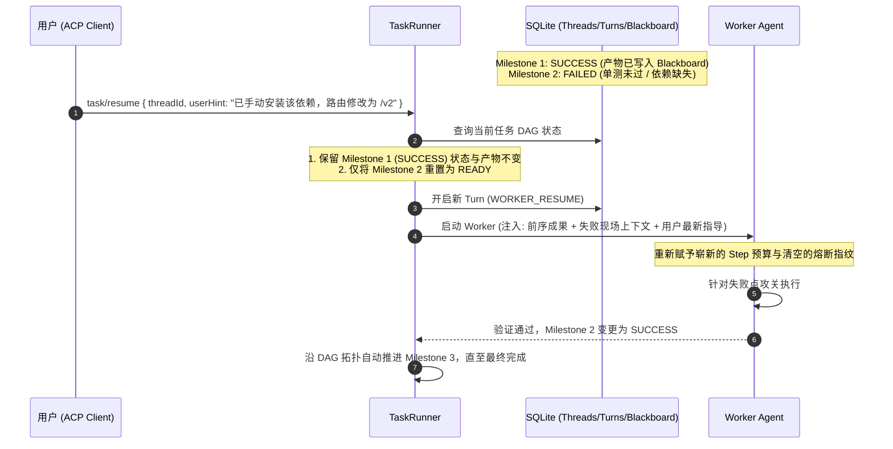
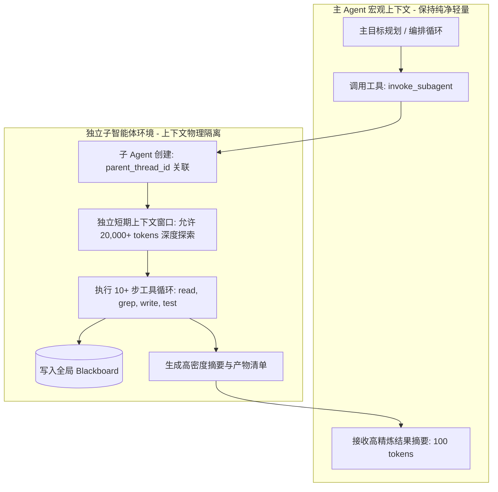

# 长任务 Agent 运行时架构设计规范 (TypeScript / Node.js 24)

本设计规范面向需要处理长周期、多步骤、复杂规划的智能体任务，完整涵盖从客户端通信协议（ACP）、运行时状态机、**Thread-Turn-Step 分层执行与度量体系**、持久化与崩溃恢复、分层规划执行引擎、上下文与黑板系统、技能与工具生态、安全策略与审批机制，到模型 Provider 适配的端到端架构设计。

---

## 目录
1. [系统总体架构与设计原则](#1-系统总体架构与设计原则)
2. [协议层：Agent Client Protocol (ACP) 规范与传输](#2-协议层agent-client-protocol-acp-规范与传输)
3. [核心分层模型：Thread - Turn - Step 执行与度量体系](#3-核心分层模型thread---turn---step-执行与度量体系)
4. [任务生命周期与核心状态机](#4-任务生命周期与核心状态机)
5. [持久化与长任务恢复引擎 (Event Sourcing on SQLite)](#5-持久化与长任务恢复引擎-event-sourcing-on-sqlite)
6. [执行引擎：Planner-Worker 与 DAG 编排](#6-执行引擎planner-worker-与-dag-编排)
7. [上下文与分层记忆机制 (Blackboard & Memory)](#7-上下文与分层记忆机制-blackboard--memory)
8. [技能 (Skills) 与工具 (Tools) 架构](#8-技能-skills-与工具-tools-架构)
9. [安全策略与人机协同审批 (Security Policy & HITL)](#9-安全策略与人机协同审批-security-policy--hitl)
10. [模型 Provider 适配层 (OpenAI 协议兼容)](#10-模型-provider-适配层-openai-协议兼容)
11. [阶段耗时与 Token 度量分析系统 (Metrics & Telemetry)](#11-阶段耗时与-token-度量分析系统-metrics--telemetry)
12. [工程化代码组织与核心接口定义](#12-工程化代码组织与核心接口定义)

---

## 1. 系统总体架构与设计原则

### 1.1 总体架构图

```
┌───────────────────────────────────────────────────────────────────────────┐
│                      Client Layer (IDE / Editor / CLI)                    │
│                                                                           │
│   Zed Editor / VSCode Extension / Web Dashboard / Headless Agent Runner   │
└─────────────────────────────────────┬─────────────────────────────────────┘
                                      │ ACP Protocol (JSON-RPC 2.0 / stdio / SSE)
┌─────────────────────────────────────▼─────────────────────────────────────┐
│                            Agent Runtime Core                             │
│                                                                           │
│  ┌─────────────────────────────────────────────────────────────────────┐  │
│  │                     ACP Protocol Adapter & Router                   │  │
│  │  - Session Manager    - Stream Multiplexer    - Permission Gateway  │  │
│  └──────────────────────────────────┬──────────────────────────────────┘  │
│                                     │                                     │
│  ┌──────────────────────────────────▼──────────────────────────────────┐  │
│  │       Thread - Turn - Step Hierarchical Execution Controller        │  │
│  │  ┌───────────────────────────────────────────────────────────────┐  │  │
│  │  │ Thread: Macro Task Scope (Blackboard, Task Life, Total Budget) │  │  │
│  │  │   └─► Turn: Phase/Milestone Loop (Planner, Worker, Approval)  │  │  │
│  │  │         └─► Step: Atomic Action (Model Call, Tool, Compact)   │  │  │
│  │  └───────────────────────────────────────────────────────────────┘  │  │
│  │  - Duration Timer       - Token Aggregator      - Step Telemetry    │  │
│  └──────────────────────────────────┬──────────────────────────────────┘  │
│                                     │                                     │
│  ┌──────────────────────────────────▼──────────────────────────────────┐  │
│  │                 Execution Engine (Planner-Worker DAG)               │  │
│  │  ┌───────────────────────┐            ┌──────────────────────────┐  │  │
│  │  │    Master Planner     │ ──DAG───►  │     Worker Agents        │  │  │
│  │  │ (Goal Decomposition)  │            │ (Subtask Isolated Loop)  │  │  │
│  │  └───────────────────────┘            └─────────────┬────────────┘  │  │
│  └─────────────────────────────────────────────────────┼───────────────┘  │
│                                                        │                  │
│       ┌────────────────────────┬───────────────────────┼──────────────┐   │
│       │                        │                       │              │   │
│  ┌────▼─────────────┐   ┌──────▼────────────┐   ┌──────▼──────────┐ ┌─▼───▼────┐
│  │ Context & Memory │   │  Skills & Tools   │   │ Security Policy │ │ LLM      │
│  │ - Blackboard     │   │ - Skill Registry  │   │ - Tiered RBAC   │ │ Provider │
│  │ - Ephemeral Mem  │   │ - Native Tools    │   │ - WorkspaceJail │ │ - OpenAI │
│  │ - Compactor      │   │ - MCP Clients     │   │ - HITL Approval │ │ - Stream │
│  └──────────────────┘   └───────────────────┘   └─────────────────┘ └──────────┘
│                                     │                                     │
│  ┌──────────────────────────────────▼──────────────────────────────────┐  │
│  │           Persistence & Journaling Engine (node:sqlite)             │  │
│  │  - Threads, Turns, Steps Tables   - Event Store   - Metric Queries │  │
│  └─────────────────────────────────────────────────────────────────────┘  │
└───────────────────────────────────────────────────────────────────────────┘
```

### 1.2 核心设计原则
1. **结构化层次执行 (Thread-Turn-Step)**：运行时将长任务清晰划分为长程线程（Thread）、阶段回合（Turn）与原子步骤（Step），天然支持对长任务各阶段耗时、Token 消耗及调用次数的多维下钻分析。
2. **确定性与耐用性 (Durable Execution)**：所有关键状态转换、工具输入输出、用户审批结果均以追加式事件（Event Sourcing）落地持久化，进程意外崩溃重启后可完整自愈并断点续跑。
3. **上下文隔离 (Context Isolation)**：主规划器（Planner）与工作智能体（Workers）上下文严格物理隔离，全局事实沉淀于黑板（Blackboard），彻底避免长任务单窗口 Token 膨胀。
4. **协议标准化 (Protocol Compliance)**：完全适配 Agent Client Protocol (ACP) 与 OpenAI Chat Completions / Tool Calling 规范，天然无缝融入现代编辑器生态与模型中转基础设施。
5. **安全先验与最小特权 (Secure by Default)**：内置四级操作风险分层与工作区沙箱限制，一切破坏性或外部高危操作均通过 ACP HITL 机制挂起等待人类授权。
6. **现代 Node.js 24 原生底座**：充分发挥 Node 24 特性，直接利用原生 `node:sqlite`、原生 `fetch` 与 `ReadableStream`、原生 `AbortController`，零无谓臃肿三方依赖。

---

## 2. 协议层：Agent Client Protocol (ACP) 规范与传输

### 2.1 通信传输方式
支持两种传输形态：
- **stdio 管道模式（默认）**：适用于由编辑器（如 Zed、Cursor、VS Code）或 CLI 直接以子进程方式启动 Agent，双向通信通过标准输入输出传输以 `\n` 分隔的 JSON-RPC 2.0 消息包。
- **SSE / HTTP 模式**：适用于远程部署或 Web UI 客户端，控制指令通过 HTTP POST 发送，状态流、思考过程与工具调用事件通过 Server-Sent Events (SSE) 持续下发。

### 2.2 官方 ACP 标准 JSON-RPC 核心方法清单 (Canonical ACP Specification)

系统完全对齐官方 Agent Client Protocol 规范，遵循 Session-Centric 交互架构：

| 阶段 / 类别 | 官方标准方法名 | 方向 | 语义与契约说明 |
| :--- | :--- | :--- | :--- |
| **握手协商** | **`initialize`** | Client -> Agent | 握手、交换 Client/Agent Capabilities，协商 `protocolVersion`（如 `2024-11-05`） |
| **标准取消** | **`$/cancel_request`** | Client -> Agent | JSON-RPC 标准取消通知，中断指定 ID 的在途异步请求 |
| **会话建立** | **`session/new`** | Client -> Agent | 初始化新会话实体，绑定 `roots` 根目录，返回分配的 `sessionId` |
| **交互提示** | **`session/prompt`** | Client -> Agent | 向会话发送用户需求，启动长任务执行循环；流式推送 `session/update`，最终返回执行报告 |
| **断点恢复** | **`session/load`** | Client -> Agent | 加载并恢复指定 `sessionId` 的上下文，执行失败节点的断点续跑 |
| **会话中断** | **`session/cancel`** | Client -> Agent | 中断当前 Session 正在运行的执行流（级联触发 `AbortController.abort()`） |
| **安全审批 (HITL)** | **`session/request_permission`** | Agent -> Client | **智能体向客户端发起高危授权申请**（包含 `toolCall`、`riskLevel`、`description`）；客户端返回 `approved` / `rejected` / `approved_always` |
| **流式状态更新** | **`session/update`** | Agent -> Client | 实时流式通知：携带 `sessionId`、`updateType`（`state_changed`, `turn_started`, `step_finished` 等）与增量数据 |
| **兼容扩展别名** | `task/start`, `task/resume`, `task/status` | Client -> Agent | 面向自动化脚本与非编辑器客户端的任务中心化快捷别名（双轨支持） |

---

## 3. 核心分层模型：Thread - Turn - Step 执行与度量体系

为了精准分析一次长任务过程中各个阶段的耗时、Token 使用以及调用次数，Runtime 严格按照三层拓扑进行组织：

```
Thread (长任务全局生命周期: Goal, Blackboard, Task State)
  │
  ├── Turn 0: PLANNING (主规划器回合: 目标理解、环境探测、生成 DAG)
  │     ├── Step 0: MODEL_CALL (分析需求，耗时 1820ms, 1250 tokens)
  │     ├── Step 1: TOOL_EXECUTION (list_dir, 耗时 45ms, 0 tokens)
  │     └── Step 2: MODEL_CALL (产出 Milestone DAG, 耗时 2100ms, 1800 tokens)
  │
  ├── Turn 1: WORKER (Milestone 1 执行回合: 接口骨架编写)
  │     ├── Step 0: MODEL_CALL (规划代码修改方案, 耗时 1600ms, 2100 tokens)
  │     ├── Step 1: TOOL_EXECUTION (write_file, 耗时 32ms, 0 tokens)
  │     └── Step 2: MODEL_CALL (验证文件, 耗时 800ms, 900 tokens)
  │
  ├── Turn 2: APPROVAL (人机协同挂起回合: 命令执行审批)
  │     └── Step 0: APPROVAL_WAIT (等待 Client 审批 npm test, 耗时 6200ms)
  │
  ├── Turn 3: WORKER (Milestone 2 执行回合: 运行测试并自愈修复)
  │     ├── Step 0: TOOL_EXECUTION (run_command: npm test, 耗时 3400ms)
  │     ├── Step 1: MODEL_CALL (解析单测失败栈, 耗时 1900ms, 2600 tokens)
  │     └── Step 2: TOOL_EXECUTION (write_file: 修复 Bug, 耗时 28ms)
  │
  └── Turn 4: SUMMARY (成果打包与 Diff 归档回合)
        └── Step 0: ARTIFACT_INDEXING (生成总结与 Diff, 耗时 120ms)
```

### 3.1 三层语义职责详解

| 层次 | 实体 | 生命周期与范围 | 核心聚合指标 (Telemetry) |
| :--- | :--- | :--- | :--- |
| **Thread** | **宏观任务线程** | 从任务被 `task/start` 创建到终态（`COMPLETED` / `FAILED` / `CANCELLED`）。绑定一个全局 Blackboard 和工作空间。 | - `totalDurationMs`（整体执行历时）<br/>- `totalTurns`（总回合数）<br/>- `totalSteps`（总步骤数）<br/>- `totalTokens`（输入/输出/总 Token）<br/>- `estimatedCostUsd`（根据模型价格计算的预估成本） |
| **Turn** | **阶段执行回合** | 一个特定的阶段闭环。类型包括：<br/>1. `PLANNING`<br/>2. `WORKER` (绑定具体 Milestone)<br/>3. `APPROVAL` (HITL 审批等待)<br/>4. `USER_INPUT` (人机补全对话)<br/>5. `SUMMARY` (任务收尾) | - `turnId`, `turnIndex`, `turnType`<br/>- `milestoneId`（子任务归属）<br/>- `durationMs`（回合总耗时）<br/>- `tokenUsage`（该回合消耗的 Prompt/Completion Tokens）<br/>- `stepCount`（包含的 Step 数量）<br/>- `status` (`SUCCESS` / `FAILED` / `SUSPENDED`) |
| **Step** | **原子操作步骤** | 最小执行单元。类型包括：<br/>1. `MODEL_CALL` (LLM 推理)<br/>2. `TOOL_EXECUTION` (工具执行)<br/>3. `APPROVAL_WAIT` (等待授权)<br/>4. `CONTEXT_COMPACT` (上下文压缩)<br/>5. `ARTIFACT_INDEXING` (产物归档) | - `stepId`, `stepIndex`, `stepType`<br/>- `startedAt`, `completedAt`<br/>- `durationMs`（单步精确到毫秒的耗时）<br/>- `tokenUsage`（Prompt/Completion/Total Tokens）<br/>- `toolName`, `isTruncated`, `error` |

### 3.2 阶段下钻分析能力
借助此模型，系统在运行时与结束后能回答以下深度分析问题：
1. **长任务各阶段耗时分布**：Planner 耗时占比 vs Worker 执行耗时 vs 等待用户审批耗时 vs 运行单测/Shell 耗时。
2. **Token 消耗漏斗**：哪一个 Milestone/Turn 消耗了最多的 Token？是否存在由于 Worker 陷入 Debug 循环导致的 Token 骤增？
3. **工具调用频次与延迟排行**：哪个 Tool 被调用最频繁？平均执行延迟最高的是哪个工具？
4. **模型调用效率**：平均每次 `MODEL_CALL` 的首字延迟（TTFT）与总耗时是多少。

---

## 4. 任务生命周期与核心状态机

### 4.1 状态机模型定义



---

## 5. 持久化与长任务恢复引擎 (Event Sourcing on SQLite)

采用 Node.js 24 原生 `node:sqlite` 实现轻量级、嵌入式、零外部服务依赖的事件驱动追加日志与层次度量表。

### 5.1 SQLite 数据库表结构设计

```sql
-- 1. 线程主表 (Threads)
CREATE TABLE IF NOT EXISTS threads (
    thread_id TEXT PRIMARY KEY,
    session_id TEXT NOT NULL,
    current_state TEXT NOT NULL,
    current_turn_id TEXT,
    prompt TEXT NOT NULL,
    workspace_path TEXT NOT NULL,
    created_at INTEGER NOT NULL,
    updated_at INTEGER NOT NULL,
    completed_at INTEGER,
    total_duration_ms INTEGER DEFAULT 0,
    total_prompt_tokens INTEGER DEFAULT 0,
    total_completion_tokens INTEGER DEFAULT 0,
    total_tokens INTEGER DEFAULT 0,
    total_turns INTEGER DEFAULT 0,
    total_steps INTEGER DEFAULT 0,
    error_message TEXT
);

-- 2. 回合表 (Turns) - 记录各阶段耗时与 Token 使用
CREATE TABLE IF NOT EXISTS turns (
    turn_id TEXT PRIMARY KEY,
    thread_id TEXT NOT NULL,
    turn_index INTEGER NOT NULL,
    turn_type TEXT NOT NULL, -- PLANNING, WORKER, APPROVAL, USER_INPUT, SUMMARY
    milestone_id TEXT,       -- 所属子任务 ID（若为 WORKER 回合）
    status TEXT NOT NULL,    -- RUNNING, COMPLETED, FAILED, SUSPENDED
    started_at INTEGER NOT NULL,
    completed_at INTEGER,
    duration_ms INTEGER DEFAULT 0,
    prompt_tokens INTEGER DEFAULT 0,
    completion_tokens INTEGER DEFAULT 0,
    total_tokens INTEGER DEFAULT 0,
    step_count INTEGER DEFAULT 0,
    summary TEXT,
    FOREIGN KEY(thread_id) REFERENCES threads(thread_id) ON DELETE CASCADE
);

CREATE INDEX IF NOT EXISTS idx_turns_thread ON turns(thread_id, turn_index);

-- 3. 单步表 (Steps) - 记录原子操作、模型推理与工具耗时
CREATE TABLE IF NOT EXISTS steps (
    step_id TEXT PRIMARY KEY,
    turn_id TEXT NOT NULL,
    thread_id TEXT NOT NULL,
    step_index INTEGER NOT NULL,
    step_type TEXT NOT NULL, -- MODEL_CALL, TOOL_EXECUTION, APPROVAL_WAIT, CONTEXT_COMPACT, ARTIFACT_INDEXING
    tool_name TEXT,          -- 若为 TOOL_EXECUTION 记录工具名
    status TEXT NOT NULL,    -- RUNNING, SUCCESS, FAILED, REJECTED
    started_at INTEGER NOT NULL,
    completed_at INTEGER,
    duration_ms INTEGER DEFAULT 0,
    prompt_tokens INTEGER DEFAULT 0,
    completion_tokens INTEGER DEFAULT 0,
    total_tokens INTEGER DEFAULT 0,
    error_message TEXT,
    metadata TEXT,           -- 附加结构化数据 (JSON)
    FOREIGN KEY(turn_id) REFERENCES turns(turn_id) ON DELETE CASCADE,
    FOREIGN KEY(thread_id) REFERENCES threads(thread_id) ON DELETE CASCADE
);

CREATE INDEX IF NOT EXISTS idx_steps_turn ON steps(turn_id, step_index);
CREATE INDEX IF NOT EXISTS idx_steps_thread ON steps(thread_id, step_type);

-- 4. 追加事件日志表 (Event Sourcing Journal - 唯一真实源与回放底座)
CREATE TABLE IF NOT EXISTS task_events (
    event_id INTEGER PRIMARY KEY AUTOINCREMENT,
    thread_id TEXT NOT NULL,
    turn_id TEXT,
    step_id TEXT,
    event_type TEXT NOT NULL,
    payload TEXT NOT NULL, -- JSON
    created_at INTEGER NOT NULL,
    FOREIGN KEY(thread_id) REFERENCES threads(thread_id) ON DELETE CASCADE
);

CREATE INDEX IF NOT EXISTS idx_task_events ON task_events(thread_id, event_id);

-- 5. 全局黑板持久化表 (Blackboard Entries)
CREATE TABLE IF NOT EXISTS blackboard_entries (
    thread_id TEXT NOT NULL,
    entry_key TEXT NOT NULL,
    entry_value TEXT NOT NULL,
    updated_at INTEGER NOT NULL,
    PRIMARY KEY(thread_id, entry_key)
);

-- 6. 执行产物与文件变动表 (Artifacts)
CREATE TABLE IF NOT EXISTS artifacts (
    artifact_id TEXT PRIMARY KEY,
    thread_id TEXT NOT NULL,
    file_path TEXT NOT NULL,
    action TEXT NOT NULL, -- CREATE, MODIFY, DELETE
    diff_content TEXT,
    created_at INTEGER NOT NULL
);
```

### 5.2 崩溃恢复算法 (Crash Recovery Flow)
当 Agent 进程意外中断或重启后执行：
1. **扫描未完结 Thread**：查询 `threads` 表中状态处于 `RUNNING`、`PLANNING` 或 `SUSPENDED_*` 的记录。
2. **事件流回放 (Replay)**：
   - 读取该任务全部历史事件，重建内存模型（已完成的 Turn/Step、DAG 完成进度、黑板数据）。
   - 将中断前处于 `RUNNING` 状态的 Step 自动标记为 `CRASHED`，记录中断时间戳。
3. **断点状态判决**：
   - 若上次中断在审批阶段，检查 ACP Client 是否重新连接；若重新连上，重新推送待审批条目。
   - 若中断在 Worker 执行阶段，自恢复机制开启新一个恢复 Turn，注入当前未完成的 Milestone 上下文从 Checkpoint 续跑。

---

## 6. 执行引擎：Planner-Worker 与 DAG 编排

### 6.1 规划器 (Master Planner)
- **执行宿主**：在 `PLANNING` 类型的 Turn 中执行。
- **职责**：将长远宏观目标拆解为具象、可验证的 Milestone 有向无环图（DAG）。
- **产出结构**：
  ```json
  {
    "goal": "迁移身份认证模块到 JWT",
    "milestones": [
      {
        "id": "ms_01",
        "title": "梳理现有代码与依赖分析",
        "dependencies": [],
        "workerSkill": "analyst",
        "acceptanceCriteria": "生成接口与调用点清单"
      },
      {
        "id": "ms_02",
        "title": "实现 JWT 生成与校验服务",
        "dependencies": ["ms_01"],
        "workerSkill": "developer",
        "acceptanceCriteria": "jwt.service.ts 通过单元测试"
      },
      {
        "id": "ms_03",
        "title": "更新路由守卫并执行全量单测",
        "dependencies": ["ms_02"],
        "workerSkill": "qa",
        "acceptanceCriteria": "npm test 全部通过"
      }
    ]
  }
  ```

### 6.2 子任务工作者 (Worker Agents)
- **执行宿主**：每个处于可执行状态的 Milestone 分配一个独立的 `WORKER` Turn。
- **上下文隔离性**：每个 Worker 仅在所属 Turn 内维护短期记忆，避免前序步骤的无效 Token 干扰后续工作。
### 6.3 任务终止条件的判定与双重验收守卫 (Dual Verification)

长任务的正常终止与异常退出必须具备严谨的客观判定，防止过早假性完成或无休止失控：



1. **子任务局部验收 (Milestone Verification)**：
   - **优先确定性机器守卫**：若 Milestone 声明了 `acceptanceCriteria`（如测试指令 `npm test`、类型检查 `tsc --noEmit`、构建命令 `npm run build`），Worker 必须调用工具执行该命令且返回 `exitCode === 0`，才允许标记完成。
   - **次选结构化自证守卫**：对于文档分析或无测试命令的任务，Worker 必须产出结构化的产物清单、代码变动锚点与结论说明，写入全局黑板。
2. **长任务全局终止 (Thread Termination)**：
   - 当且仅当 DAG 中所有里程碑均成功达到 `SUCCESS` 终态且所有必需文件产物均落盘后，主控循环进入 `SUMMARY` Turn，产出全局审计报告与度量汇总，Thread 状态变更为 `COMPLETED`。
   - 若关键路径上的 Milestone 遭遇不可恢复错误或触碰熔断硬顶，Thread 状态变更为 `FAILED`，完整冻结现场，不继续执行后续下游节点。

---

### 6.4 错误特征分类与主动阻断求助 (Transient vs Fatal & Fast-Fail)

杜绝大模型在面临客观阻碍时持续产生无意义的幻觉盲目重试：

| 错误类别 | 典型特征与场景 | Runtime 处置策略 |
| :--- | :--- | :--- |
| **瞬态自愈型<br/>(Transient / Recoverable)** | 1. 代码语法错误、类型检查未过<br/>2. 单元测试断言失败<br/>3. 模型提供商 API 偶发 429 限流或 503 网络抖动 | **受控自动重试**：<br/>- API 层配合指数退避与 Jitter 自动重试<br/>- 逻辑层在当前 Turn 步数预算内，将报错作为 Tool Result 反馈给 Worker，允许其修改代码自愈 |
| **致命阻塞型<br/>(Fatal / Blocked)** | 1. 缺少必要鉴权信息（API Key、凭证、私钥被拒）<br/>2. 目标外部服务不可达、端口被占用且无法杀死<br/>3. 必需的系统依赖缺失且沙箱无权安装<br/>4. 用户提示词存在核心逻辑矛盾、依赖的基准代码不存在 | **立即熔断阻断 (Fast-Fail)**：<br/>- **严禁模型自主重试**！立即终止当前 Worker 循环<br/>- 状态切为 `SUSPENDED_INPUT`（或 `BLOCKED_NEED_USER`）<br/>- 通过 ACP 协议发出结构化阻断通知，明确告知用户阻断原因与建议干预步骤 |

---

### 6.5 智能防死锁与振荡检测熔断器 (Loop & Oscillation Circuit Breaker)

为解决长任务中 Worker 常见的“死循环修 Bug”或“反复横跳”问题，运行时内置三级熔断防护体系：

```
Step 0: edit(auth.ts, change A) ──► Test Failed
Step 1: edit(auth.ts, revert to B) ──► Test Failed
Step 2: edit(auth.ts, change A again) ──► [DETECTED OSCILLATION] ──► 立即熔断并冻结现场!
```

1. **动作指纹与重复调用检测 (Action Fingerprinting)**：
   - 对每个工具调用的 `(toolName, canonicalJson(params))` 计算哈希指纹。
   - 若同一个工具以完全相同的参数连续调用 2 次且均返回失败，判定为“同构死循环”，立即打断并阻断后续调用。
2. **振荡死锁检测器 (Oscillation / Ping-Pong Detector)**：
   - 维护当前 Turn 内最近 6 步的文件变动指纹栈。
   - 当检测到模式为 $A \to B \to A$ 的反复回滚或交替修改时，判定为“振荡修改陷阱”，自动强制终止当前 Worker 执行。
3. **多维硬顶预算限制 (Hard Budget Guards)**：
   - **单 Turn 最大 Step 上限**：默认单 Turn 最多允许 10 个 Step，达到上限立即强制收敛，禁止无限迭代。
   - **单 Thread 预算上限**：配置整个任务允许消耗的最大 Token 总量与最长持续时间（Timeout），超时或超额自动安全挂起。

---

### 6.6 精准断点增量恢复 (Targeted Breakpoint Resume - 零重跑机制)

当长任务在某一 Milestone 失败、发生死锁熔断或被用户手动暂停修正后，用户触发 Retry 时，**系统绝不重跑已成功的历史任务**：



1. **已达成状态的绝对持久保护**：
   - 所有在 SQLite 中标记为 `SUCCESS` 的 Milestone 拓扑节点、已生成的文件清单、统一 Diff 记录以及全局黑板数据全部保持生效，不进行无谓的回滚或重放，节省大量 Token 与执行时间。
2. **失败节点的状态重置**：
   - 仅将发生失败的 Milestone 状态从 `FAILED` / `BLOCKED` 重置为 `READY`。
3. **上下文智能拼接与新 Turn 启动**：
   - 开启全新的 `WORKER_RESUME` Turn，给与崭新的单 Turn 步数预算（Step Budget），重置熔断计数器。
   - 为 Worker 组装极高针对性的输入上下文：
     - **已知事实库**：从黑板提取前序成功节点产出的核心数据；
     - **失败诊断快照**：上一次失败的精确错误信息（如单测报错堆栈、编译错误行号）；
     - **人类干预输入 (User Hint)**：用户在 Retry 时提供的纠偏指示或修复说明。
4. **下游依赖继续驱动**：
   - 待该断点节点重新通过验收守卫标记为 `SUCCESS` 后，DAG 拓扑调度引擎自动向下寻路，顺畅执行后续待办节点，完成整个长任务交付。

---

### 6.7 子 Agent 任务分发与上下文物理隔离机制 (Sub-agent Delegation & Context Isolation)

针对需要大规模探索、深度重构或大篇幅文档阅读的超长任务，若所有操作均在主 Agent 上下文中执行，会导致上下文窗口迅速膨胀而失忆或触发 Token 上限。Runtime 原生支持 **Sub-agent（子智能体）** 分发体系：



1. **父子线程层次关联 (`parent_thread_id`)**：
   - 通过 `SubagentManager` 孵化子 Agent，在 SQLite `threads` 表中生成独立的 Child Thread 记录，并设置 `parent_thread_id = masterThread.id`。
   - 子智能体拥有独立的状态机、独立的 Turn 和 Step 记录，其消耗的 Token、耗时与工具调用完全可追溯，不污染主任务的近期消息列表。
2. **上下文物理隔离与防溢出保护**：
   - 子智能体被分配专有任务提示词（`[Subagent: <Role>] <taskDescription>`）以及专属 Skill（`analyst`、`developer`、`qa`）。
   - 子智能体可以在其独立的上下文中执行 10+ 步反复调试或大文件检索（消耗数万 Token），执行完毕后**仅将最终成果沉淀至全局 Blackboard，并向主智能体回传百余字的核心摘要**，主 Agent 的上下文始终保持极简轻量。
3. **协议级多 Agent 观测通知**：
   - 子智能体启动和完成时，通过 ACP 发送携带 `subagent_started` 和 `subagent_finished` 的 `session/update` 通知，使得 IDE / 客户端 UI 能够实时渲染多 Agent 协作树形拓扑。
4. **一等公民工具接口 (`invoke_subagent`)**：
   - 主智能体与工作者在任何阶段均可主动调用内置 `invoke_subagent` 工具，将复杂局部子任务（如“通读所有迁移脚本提取外键依赖”）委派给子 Agent 独立攻坚。

---

## 7. 上下文与分层记忆机制 (Blackboard & Memory)

### 7.1 分层架构
1. **Layer 1: Global Blackboard (全局黑板)**：
   - 贯穿整个 Thread 生命周期，存放任务总体目标、Milestone DAG 拓扑状态、关键文件清单、共享变量。
2. **Layer 2: Worker Ephemeral Context (工作者短期上下文)**：
   - 仅在当前 Turn 中有效，包括所属 Skill 指令、当前 Milestone 目标、黑板上下文切片、最近几轮工具交互历史。
3. **Layer 3: Auto Compaction & Pruning (即时裁切与滚动压缩)**：
   - **工具输出即时截断**：单次工具输出超过阈值（如 2500 tokens / 8000 字符）时截取首尾各 1000 字符，中间内容存盘并用日志路径占位。
   - **渐进式总结**：Turn 内上下文占用超过窗口阈值（如 70%）时触发增量总结，压缩早期对话轮次。

---

## 8. 技能 (Skills) 与工具 (Tools) 架构 (参考 OpenCode & Pi 规范)

### 8.1 概念解耦与职责
- **Tool (原子可执行单元)**：
  - 具备标准输入输出 JSON Schema、参数校验与风险等级标记。
  - 具备执行超时、输出截断与结构化结果返回机制。
- **Skill (领域能力集成包)**：
  - 代表特定领域或工种的复合能力（包含 `SKILL.md` 指令规范、工作流与所需 Tools 最小子集）。
  - 支持通过内置 `skill` 工具在任务运行期动态加载激活。

### 8.2 工具矩阵与功能定义 (OpenCode / Pi 标准工具集)

#### 1. 核心文件与命令工具 (Core Filesystem & Command Tools)
| 工具名 | 风险等级 | 参数签名摘要 | 职责说明 |
| :--- | :--- | :--- | :--- |
| **`bash`** | `HIGH_RISK_EXEC` | `{ command: string, cwd?: string, timeoutMs?: number }` | 在项目工作区环境中执行 shell 命令（如 `npm test`、`git status`、`npm install`），支持进程超时强制终止与标准输出/错误截断。 |
| **`edit`** | `WORKSPACE_WRITE` | `{ filePath: string, oldStr: string, newStr: string, allowMultiple?: boolean }` | **LLM 修改代码的主要方式**。通过在目标文件中精确匹配 `oldStr` 并替换为 `newStr`，避免全量重写带来的 Token 浪费与幻觉覆盖。 |
| **`write`** | `WORKSPACE_WRITE` | `{ filePath: string, content: string, overwrite?: boolean }` | 创建新文件或全量覆盖现有文件，自动创建不存在的父级目录。 |
| **`read`** | `READ_ONLY` | `{ filePath: string, startLine?: number, endLine?: number }` | 读取指定文件内容，支持大文件的行号范围切片读取（1-based），超大文件带行数指示与截断保护。 |
| **`grep`** | `READ_ONLY` | `{ pattern: string, path?: string, glob?: string, caseSensitive?: boolean }` | 使用正则表达式在代码库中高性能搜索文件内容，返回匹配文件的相对路径、行号与匹配行内容。 |
| **`glob`** | `READ_ONLY` | `{ pattern: string, cwd?: string }` | 通过模式匹配（如 `**/*.ts`、`src/**/*.json`）查找文件，返回按最近修改时间排序的文件路径列表。 |

#### 2. 扩展与辅助工具 (Extended & Auxiliary Tools)
| 工具名 | 风险等级 | 参数签名摘要 | 职责说明 |
| :--- | :--- | :--- | :--- |
| **`patch`** / **`apply_patch`** | `WORKSPACE_WRITE` | `{ filePath: string, patch: string }` | 对文件应用标准 Unified Diff 补丁，适合执行由外部或 Git 生成的标准变更集。 |
| **`skill`** | `READ_ONLY` | `{ skillName: string }` | 动态加载指定 `SKILL.md` 技能定义文件并返回其规则与最佳实践说明，用于长任务各阶段按需装载专业知识。 |
| **`todowrite`** | `READ_ONLY` | `{ todos: Array<{ id: string, content: string, status: 'pending' \| 'in_progress' \| 'completed' }> }` | 在长任务执行会话中管理待办事项清单（TODO List），状态自动同步至全局 Blackboard，用于追踪多步骤任务进度。 |
| **`webfetch`** | `NETWORK` | `{ url: string, format?: 'markdown' \| 'text' }` | 获取并解析网页内容（自动去除无用标签并将 HTML 转换为 Markdown），适合查阅官方技术文档或在线 API 资源。 |
| **`websearch`** | `NETWORK` | `{ query: string, maxResults?: number }` | 执行网络搜索（可适配 Exa AI、Google 或通用 Search API），适合获取训练知识库截止日期之后的最新信息。 |
| **`question`** | `READ_ONLY` | `{ question: string, options?: string[], context?: string }` | 在执行任务期间向用户提问，用于收集用户偏好、澄清模糊指令或获取关键决策。触发 `SUSPENDED_INPUT` 并联动 ACP。 |
| **`lsp`** *(实验性)* | `READ_ONLY` | `{ action: 'definition' \| 'references' \| 'hover', filePath: string, line: number, character: number }` | 与配置好的 LSP (Language Server Protocol) 服务器交互，提供精确的符号跳转、引用查找与类型悬停信息。 |

---

## 9. 安全策略与人机协同审批 (Security Policy & HITL)

### 9.1 四级风险体系 (Risk Tiers)
1. `READ_ONLY` (Tier 1)：只读动作，自动放行。
2. `WORKSPACE_WRITE` (Tier 2)：工作区内文件写操作，校验 Workspace Jail 后放行。
3. `HIGH_RISK_EXEC` (Tier 3)：命令执行、文件删除、依赖安装。触发 `SUSPENDED_APPROVAL`，开启 `APPROVAL` Turn，向客户端发起 `permission/request`。
4. `NETWORK_OR_CRITICAL` (Tier 4)：越界操作、访问系统关键目录。物理阻断。

### 9.2 审批等待与度量
在 `APPROVAL` Turn 内记录专门的 `APPROVAL_WAIT` Step，精准量化长任务中因为“等待人工审批”所花费的滞留时间，不计入模型计算耗时。

---

## 10. 模型 Provider 适配层 (OpenAI 协议兼容)

### 10.1 核心特性
- **标准 OpenAI 兼容**：通过原生 `fetch` 与 `ReadableStream` 请求 `/v1/chat/completions`。
- **SSE 多分块流式解析**：聚合增量 delta 文本与分片拼接 `tool_calls`。
- **指数退避重试 (Exponential Backoff with Jitter)**：自动应对 429、502/503 错误。
- **Token 计量提取器**：精准截取模型返回的 `prompt_tokens` 与 `completion_tokens`，逐级累加到 Step -> Turn -> Thread。

---

## 11. 阶段耗时与 Token 度量分析系统 (Metrics & Telemetry)

### 11.1 结构化度量查询能力 (SQL-Driven Analysis)
借助 `threads`、`turns`、`steps` 结构化持久化表，系统内置开箱即用的多维分析查询：

```sql
-- 1. 任务阶段耗时与 Token 消耗流水账 (Turn Breakdown)
SELECT 
    turn_index,
    turn_type,
    milestone_id,
    duration_ms,
    ROUND(duration_ms / 1000.0, 2) AS duration_sec,
    prompt_tokens,
    completion_tokens,
    total_tokens,
    step_count,
    status
FROM turns 
WHERE thread_id = ? 
ORDER BY turn_index ASC;

-- 2. 工具调用频次、耗时与故障率统计 (Tool Call Metrics)
SELECT 
    tool_name,
    COUNT(*) AS call_count,
    SUM(duration_ms) AS total_duration_ms,
    ROUND(AVG(duration_ms), 2) AS avg_duration_ms,
    SUM(CASE WHEN status = 'FAILED' THEN 1 ELSE 0 END) AS failed_count
FROM steps 
WHERE thread_id = ? AND step_type = 'TOOL_EXECUTION'
GROUP BY tool_name
ORDER BY call_count DESC;

-- 3. 总体耗时占比分析 (Time Allocation: Model vs Tool vs Approval)
SELECT 
    step_type,
    COUNT(*) AS occurrences,
    SUM(duration_ms) AS total_duration_ms,
    ROUND(SUM(duration_ms) * 100.0 / (SELECT total_duration_ms FROM threads WHERE thread_id = ?), 2) AS percentage
FROM steps 
WHERE thread_id = ? 
GROUP BY step_type;
```

### 11.2 任务终态度量总结报告结构 (Thread Metrics Report)
任务结束时，`TaskRunner` 会自动生成包含多维下钻表格的分析报告，随 ACP 最终事件推送到 Client 并保存为 `.agent/tasks/{threadId}/metrics_summary.json`：

```json
{
  "threadId": "task_1001",
  "totalDurationMs": 45820,
  "totalTokens": {
    "promptTokens": 18450,
    "completionTokens": 3210,
    "totalTokens": 21660,
    "estimatedCostUsd": 0.042
  },
  "counts": {
    "turns": 5,
    "steps": 14,
    "toolCalls": 8,
    "modelCalls": 4,
    "approvals": 1
  },
  "timeAllocation": {
    "modelInferenceMs": 8420,
    "toolExecutionMs": 28600,
    "approvalWaitMs": 8500,
    "overheadMs": 300
  },
  "turnsBreakdown": [
    {
      "turnIndex": 0,
      "turnType": "PLANNING",
      "durationMs": 3965,
      "totalTokens": 3050,
      "steps": 3
    },
    {
      "turnIndex": 1,
      "turnType": "WORKER",
      "milestoneId": "ms_01",
      "durationMs": 2432,
      "totalTokens": 3000,
      "steps": 3
    },
    {
      "turnIndex": 2,
      "turnType": "APPROVAL",
      "durationMs": 8500,
      "totalTokens": 0,
      "steps": 1
    },
    {
      "turnIndex": 3,
      "turnType": "WORKER",
      "milestoneId": "ms_02",
      "durationMs": 28923,
      "totalTokens": 12610,
      "steps": 6
    },
    {
      "turnIndex": 4,
      "turnType": "SUMMARY",
      "durationMs": 2000,
      "totalTokens": 0,
      "steps": 1
    }
  ]
}
```

---

## 12. 工程化代码组织与核心接口定义

### 12.1 推荐目录结构 (Node.js 24 + TypeScript)

```
myagent/
├── package.json
├── tsconfig.json
├── design.md                      # 核心架构设计规范 (包含 Thread-Turn-Step 规范)
├── src/
│   ├── index.ts                   # CLI 入口与进程引导
│   ├── protocol/                  # ACP 协议层
│   │   ├── types.ts               # ACP JSON-RPC 协议类型
│   │   ├── stdio-transport.ts     # stdio 双向流通道
│   │   ├── sse-transport.ts       # SSE / HTTP 通道
│   │   └── rpc-dispatcher.ts      # 方法路由与事件通知器
│   ├── runtime/                   # 运行时与三层分层控制
│   │   ├── thread-context.ts      # Thread 级别上下文与聚合器
│   │   ├── turn-context.ts        # Turn 级别回合生命周期控制
│   │   ├── step-context.ts        # Step 级别原子步骤计时与 Token 提取
│   │   ├── state-machine.ts       # 任务生命周期状态机
│   │   ├── task-runner.ts         # 长任务执行循环主控
│   │   └── cancellation.ts        # AbortSignal 级联取消管理
│   ├── persistence/               # 持久化与度量数据库
│   │   ├── db.ts                  # node:sqlite 连接与建表 (threads, turns, steps)
│   │   ├── event-store.ts         # Append-Only 事件日志实现
│   │   ├── telemetry-store.ts     # 耗时、Token 与次数多维聚合查询
│   │   └── recovery.ts            # 崩溃检测与断点续跑
│   ├── engine/                    # 任务编排引擎
│   │   ├── planner.ts             # Master Planner (DAG 生成与重规划)
│   │   ├── worker.ts              # Worker Agent (在 WORKER Turn 中执行)
│   │   └── dag.ts                 # DAG 依赖解析与拓扑调度
│   ├── context/                   # 上下文与记忆
│   │   ├── blackboard.ts          # 分层共享黑板
│   │   ├── memory-compactor.ts    # Token 水位监控与对话压缩
│   │   └── prompt-builder.ts      # 结构化 Prompt 组装器
│   ├── security/                  # 安全与权限策略
│   │   ├── policy-engine.ts       # 四级风险规则研判
│   │   ├── workspace-jail.ts      # 路径沙箱与敏感文件白名单
│   │   └── approval-gate.ts       # ACP HITL 挂起与等待队列
│   ├── skills/                    # 领域技能系统
│   │   ├── skill-registry.ts      # 技能注册与发现
│   │   └── builtin/               # 内置核心技能 (analyst, developer, qa)
│   ├── tools/                     # 工具生态
│   │   ├── tool-registry.ts       # 工具统一注册中心
│   │   ├── native/                # 原生工具 (fs, bash, grep, git)
│   │   └── mcp/                   # MCP 协议客户端网关
│   └── provider/                  # 模型适配层
│       ├── openai-client.ts       # OpenAI 兼容客户端封装
│       ├── stream-parser.ts       # SSE 流与 tool_calls 解码
│       └── retry-handler.ts       # 指数退避与模型 Failover
└── tests/                         # 测试套件
```

### 12.2 核心接口定义片段 (TypeScript)

```typescript
// 1. Thread, Turn, Step 层次类型定义
export type TurnType = 'PLANNING' | 'WORKER' | 'APPROVAL' | 'USER_INPUT' | 'SUMMARY';
export type StepType = 'MODEL_CALL' | 'TOOL_EXECUTION' | 'APPROVAL_WAIT' | 'CONTEXT_COMPACT' | 'ARTIFACT_INDEXING';

export interface TokenUsage {
  promptTokens: number;
  completionTokens: number;
  totalTokens: number;
}

export interface StepRecord {
  stepId: string;
  turnId: string;
  threadId: string;
  stepIndex: number;
  stepType: StepType;
  toolName?: string;
  status: 'RUNNING' | 'SUCCESS' | 'FAILED' | 'REJECTED';
  startedAt: number;
  completedAt?: number;
  durationMs: number;
  tokens: TokenUsage;
  errorMessage?: string;
  metadata?: Record<string, any>;
}

export interface TurnRecord {
  turnId: string;
  threadId: string;
  turnIndex: number;
  turnType: TurnType;
  milestoneId?: string;
  status: 'RUNNING' | 'COMPLETED' | 'FAILED' | 'SUSPENDED';
  startedAt: number;
  completedAt?: number;
  durationMs: number;
  tokens: TokenUsage;
  stepCount: number;
  summary?: string;
}

export interface ThreadRecord {
  threadId: string;
  sessionId: string;
  currentState: string;
  prompt: string;
  workspacePath: string;
  createdAt: number;
  updatedAt: number;
  completedAt?: number;
  totalDurationMs: number;
  totalTokens: TokenUsage;
  totalTurns: number;
  totalSteps: number;
  errorMessage?: string;
}

// 2. 遥测聚合分析接口
export interface ITelemetryStore {
  recordStepStart(step: Omit<StepRecord, 'durationMs' | 'status'>): Promise<void>;
  recordStepEnd(stepId: string, result: { status: StepRecord['status']; tokens?: Partial<TokenUsage>; error?: string }): Promise<void>;
  recordTurnStart(turn: Omit<TurnRecord, 'durationMs' | 'status' | 'stepCount'>): Promise<void>;
  recordTurnEnd(turnId: string, result: { status: TurnRecord['status']; summary?: string }): Promise<void>;
  getThreadReport(threadId: string): Promise<TaskExecutionSummary>;
}
```
